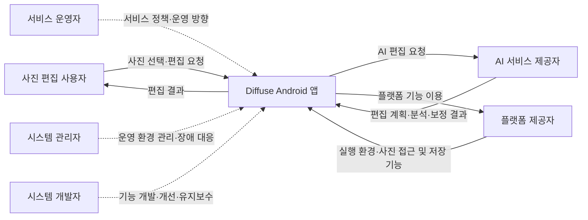

# Diffuse

## 1. 프로젝트 개요

Diffuse는 AI 시대에 걸맞게, 사용자의 감각과 의도를 사진으로 표현하는 차세대 Android 포토에디터다. “따뜻한 필름 느낌으로”, “차분한 저녁 분위기로”처럼 원하는 바이브를 말로 전달하면 AI가 편집을 도와, 복잡한 도구나 전문 지식 없이도 손쉽게 자신만의 사진을 완성할 수 있다. 원하는 분위기를 직관적으로 표현하고, 결과를 확인하며 취향에 맞게 다듬는 편집 경험이 핵심 제품 가치다.

기본 사용 흐름은 **사진 가져오기 → 편집 및 미리보기 → 적용 → 내보내기**다. 원본과 편집 작업을 분리해 관리하며, 실행 취소·다시 실행·자동 저장·프로젝트 재열기를 통해 반복 편집을 지원한다.

### 1.1 제품의 역할 및 가치

Diffuse는 **사용자의 표현 의도를 실제 사진 편집으로 연결하는 AI 편집 도우미** 역할을 한다. 사용자가 원하는 분위기와 수정 대상을 전달하면 AI가 필요한 편집을 돕고, 사용자는 미리보기와 직접 조절을 통해 최종 결과를 결정한다.

- **쉬운 표현:** 전문 용어나 복잡한 설정을 익히기 전에도 일상적인 말로 원하는 분위기를 전달할 수 있다.
- **한 문장으로 연결하는 편집 워크플로우:** “배경의 사람을 지우고 사진 전체를 따뜻하고 밝게 해줘”처럼 여러 작업을 한 문장으로 요청할 수 있다. AI가 필요한 도구와 실행 순서를 구성하고, 사용자가 단계 목록을 확인해 적용하면 순서대로 실행한다. 도구를 하나씩 찾아 전환하고 작업 순서를 직접 구성하는 부담을 줄인다.
- **개인 취향 반영:** 자동 보정과 스타일 제안을 출발점으로 삼고, 빛·색·디테일을 직접 다듬어 자신만의 결과를 만든다.
- **편집 과정의 연결:** 기본 보정, 대상 선택, 생성 편집, 인물 보정, 저장을 하나의 사진 편집 흐름 안에서 수행한다.
- **결과에 대한 통제:** 미리보기·적용·취소와 실행 취소·다시 실행을 통해 사용자가 변경 여부를 판단하고, 원본을 보존하며 여러 표현을 시도한다.

### 1.2 핵심 기능

핵심 기능과 제공 가치 및 범위는 다음과 같다.

| 기능 | 설명 |
|---|---|
| 기본 사진 편집 | 빛·색·색상별 혼합·디테일·자르기로 사용자가 직접 결과 조절 |
| AI 선택 및 생성 편집 | 대상 선택, 지우기, 채우기, 이미지 영역 확장 |
| 바이브 에디팅·자연어 편집 | 한 문장에 담긴 여러 편집 요청을 대상 선택·지우기·빛과 색 조절 등 지원 도구의 워크플로우로 구성 |
| 스타일 및 자동 보정 | 프리셋, 참조 사진의 색감 매칭, MonetGPT 자동 보정 |
| 인물 피부 보정 | 선택한 얼굴의 잡티·유분광·다크서클·면도자국을 종류별로 조절 |

### 1.3 기대효과

- **편집 진입 장벽 완화:** 자연어 지시와 자동 보정으로 초보 사용자도 원하는 결과를 만드는 데 필요한 학습 부담을 줄인다.
- **작업 시간 단축:** 여러 단계의 편집 워크플로우를 한 문장으로 요청해 도구 탐색·전환과 반복 조작을 줄인다. AI 선택·자동 보정·생성 편집과 함께, 사진의 분위기와 완성도를 판단하는 데 집중하도록 돕는다.
- **표현의 다양성과 일관성 향상:** 다양한 분위기를 시도하고, 프리셋과 참조 사진의 색감 매칭으로 여러 사진에 비슷한 시각적 분위기를 부여할 수 있다.
- **인물 사진의 자연스러운 완성도 향상:** 필요한 피부 문제를 종류별로 조절하면서 인물의 특징과 질감을 보존하는 것을 목표로 한다. 이 효과는 피부 보정의 품질 검증을 전제로 한다.

## 2. Business Context Diagram

Diffuse를 중심으로 사진 편집 사용자, 서비스 운영자, 시스템 관리자·개발자, 외부 서비스 제공자의 주요 관계를 나타낸다.

실선은 사용·서비스 연계 관계, 점선은 제품과 운영 환경에 대한 관리·개발 관계를 뜻한다.

## 3. Stakeholder List

이해관계자는 시스템과 맺는 관계에 따라 구분한다. 서비스 운영자는 서비스 정책과 운영 방향을 결정하고, 시스템 관리자는 기술적인 운영 환경과 장애를 관리한다.

| ID | 이해관계자 | 시스템과의 관계 | 주요 관심사 |
|---|---|---|---|
| SH-01 | 사진 편집 사용자 | 사진을 가져와 편집하고 결과를 저장·활용 | 쉬운 편집, 원하는 분위기 표현, 결과 품질과 작업 보존 |
| SH-02 | 서비스 운영자 | 서비스 정책, 제공 기능, 이용 방식과 운영 방향 결정 | 사용자 만족, 서비스 지속성, 사업성과 운영 비용 |
| SH-03 | 시스템 관리자 | 서버·접근 권한·설정 관리 및 장애 대응 | 가용성, 보안, 안정적인 운영과 신속한 복구 |
| SH-04 | 시스템 개발자 | 앱과 AI 기능의 개발·개선·유지보수 | 기능 정확성, 성능, 확장성과 유지보수성 |
| SH-05 | AI 서비스 제공자 | 자연어 해석, 이미지 분석·생성·보정 기능 제공 | AI 결과 품질, 응답 시간, 안정적인 연동과 자원 관리 |
| SH-06 | 플랫폼 제공자 | Android 실행 환경과 사진 접근·저장 등 기기 기능 제공 | 플랫폼 호환성, 권한 정책 준수와 안정적인 기능 이용 |

## 4. Business Goal List

아래 목표는 명세에 나타난 제품 가치를 사업 관점으로 정리한 것이다. **우선순위와 성과 지표는 제안**이며, 실제 사용자 지표 수집이 구현되어 있거나 수치 목표가 합의되었다는 의미는 아니다. P1은 핵심 사용 가치와 신뢰, P2는 차별화 및 지속 가능한 확장을 뜻한다.

| ID | 비즈니스 목표 | 기대 성과 | 관련 제품 수단 | 성과 지표 제안 | 관련 이해관계자 | 우선순위 |
|---|---|---|---|---|---|---|
| BG-01 | 사진 편집의 진입 장벽을 낮춘다 | 전문 편집 지식이 적어도 원하는 결과를 완성 | 자연어 지시, 자동 보정, 일관된 도구·미리보기 | 첫 프로젝트 내보내기 완료율, 첫 결과까지 걸린 시간, 사용자 도움 요청률 | SH-01, SH-02, SH-04 | P1 |
| BG-02 | 반복 보정에 드는 시간과 조작을 줄인다 | 사용자가 적은 조작으로 사진을 완성 | 스타일, 색감 매칭, MonetGPT 조정값, AI 선택 | 동일 과업의 수동 대비 완료 시간·조작 수, AI 결과 적용률 | SH-01, SH-04, SH-05 | P1 |
| BG-03 | 사용자가 편집 결과를 통제하고 안심하고 실험하게 한다 | 불만족한 결과를 되돌리고 기존 작업을 계속 활용 | 비파괴 편집, 취소·적용, Undo/Redo, 자동 저장·복원 | 복원 성공률, 작업 유실 건수, 취소 후 문서 보존 성공률 | SH-01, SH-04 | P1 |
| BG-04 | 빠르고 안정적으로 편집부터 저장까지 완료하게 한다 | 대기·오류로 인한 이탈 감소 | 미리보기와 최종 렌더 분리, 진행·취소·오류 안내, 내보내기 | 미리보기 지연, 내보내기 성공률·시간, 비정상 종료율 | SH-01, SH-03, SH-04 | P1 |
| BG-05 | 자연스러운 인물 보정으로 제품을 차별화한다 | 필요한 피부 문제를 줄이면서 인물의 특징과 질감 보존 | 얼굴 선택, 종류별 강도, 보호 영역, 보정 후보 미리보기 | 종류별 실사진 품질 통과율, 보호 영역 훼손률, 사용자 결과 수용률 | SH-01, SH-02, SH-04, SH-05 | P2 |
| BG-06 | 사진 처리와 외부 AI 이용에 대한 신뢰를 확보한다 | 사용자가 처리 위치와 실행 상태를 이해하고 요청 통제 | 서비스 설정, 명시적 실행, 취소, 상태별 복구 안내 | 비의도적 업로드 건수, 취소 후 결과 미반영 성공률, 전송 안내 이해도 | SH-01, SH-02, SH-03, SH-04, SH-05 | P1 |
| BG-07 | AI 기능을 지속적으로 개선할 수 있는 운영 구조를 유지한다 | 모델·기능 개선의 개발 부담과 장애 영향을 관리 | 제공자 경계, 서비스별 가용성 확인, 저장된 결과 재사용 | 기능 추가 소요 시간, 서버 요청 성공률·복구 시간, 성공 요청당 운영 비용 | SH-02, SH-03, SH-04, SH-05, SH-06 | P2 |

BG-01~04는 [아키텍처의 사용성·성능·비파괴 편집 원칙](architecture/architecture.md)과 [자연어 편집](specs/vibe_edit.md), [자동 보정](specs/auto_enhance.md)에 근거한다. BG-05~06은 [피부 보정 명세](specs/skin_retouch.md) 및 [품질 검증 기준](specs/skin_retouch_validation.md), BG-07은 [AI 제공자 경계](specs/ai_provider.md)에 근거한다.

아키텍처에 이미 기재된 성능 예산은 슬라이더 미리보기 갱신 p50 100ms 미만, 12MP JPEG 내보내기 2초 미만, 12MP 편집기 최대 메모리 250MB 미만이다. 이는 BG-04를 구체화하는 **기술 목표**이며 현재 달성 실적으로 간주하지 않는다. 이 문서 작성에서는 성능 시험을 실행하지 않았다.

## 5. 현재 제약과 미확정 사업 항목

- **피부 보정의 출시 준비:** 최신 [구현 인계](work/RESULT.md)와 [D083](work/decisions.md)에 따르면 네 보정 종류 모두 품질 기준을 통과하지 않았다. 테스트 배포에서는 잡티만 활성화되어 있으며, 나머지 세 종류는 실사진 품질 문제로 비활성화되어 있다. BG-05는 달성해야 할 목표다.
- **AI 서비스 접근성:** 서버와 키를 사용자가 설정하는 현재 방식은 일반 사용자 도입에 부담이 될 수 있다. 서버를 누가 운영하고 이용 비용을 누가 부담할지는 제품 운영 정책으로 확정해야 한다.
- **전송 환경:** 결정 로그에는 MonetGPT와 피부 보정의 HTTP 테스트 경로가 기록되어 있다. 시험 연결 완료를 출시용 암호화 전송 준비 완료로 해석하지 않는다.
- **고객·수익 모델:** 우선 고객군, 유료화·구독·크레딧, 가격, 매출 목표, 시장 규모는 검토한 문서에서 확정 근거를 찾지 못했다. 콘텐츠 제작자·소규모 판매자 등 잠재 고객군과 관련 사업 지표는 사용자 조사 후 구체화한다.
- **성과 측정:** 목표 표의 사용자 행동 지표는 측정 제안이다. 수집 범위·방식·기준값·목표값은 별도로 정해야 한다.

이 문서는 비즈니스 관점의 개요이며, 기능 요구사항은 `specs/`, 아키텍처는 `architecture/architecture.md`, 현재 구현 계약·결과·검토는 `work/tasks.md`·`work/RESULT.md`·`work/REVIEW.md`를 각각 기준으로 삼는다.
