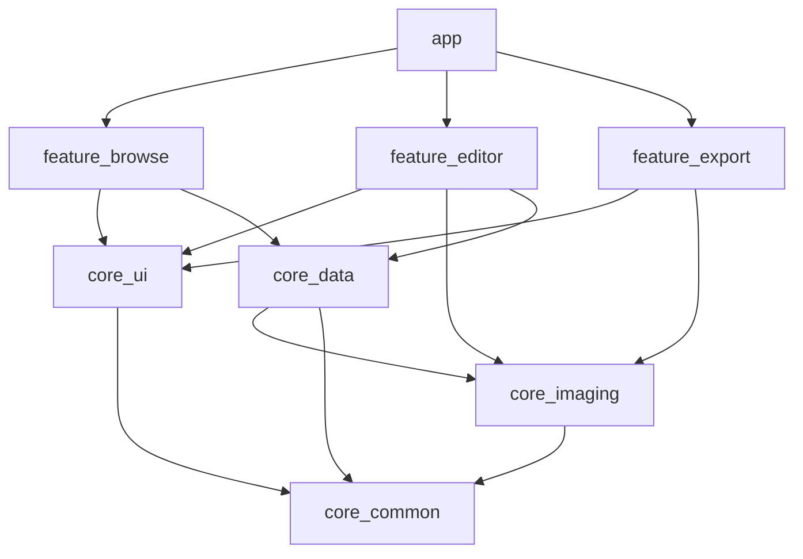

# specs/architecture.md — System architecture

Owner tasks: T01 (skeleton), T21 (navigation)
Read by every task. If a task's spec conflicts with this file, this file wins.

## 1. Quality attributes (in priority order)

| Priority | Attribute | What it means here | How we enforce it |
|---|---|---|---|
| 1 | **Extensibility** | Adding a new adjustment, tool, or AI operation must not touch existing modules' internals. v2 AI plugs in without rewriting v1. | Sealed `Operation` hierarchy, `Tool` registry, feature modules behind interfaces, dependency rule (§4) |
| 2 | **Performance** | Preview updates feel instant while dragging a slider; the app never blocks the main thread on pixels. | Preview/full render split, coalesced render requests, caches, budgets in render.md, benchmark script |
| 3 | **Usability** | The user always sees the photo, always knows what will happen, and never loses work. | Canvas ≥ 50% visible rule, non-destructive model + autosave, compare gesture, predictable Cancel/Apply |
| 4 | Testability | Every task has a machine-checkable done condition. | Pure Kotlin core, golden image tests, Roborazzi, fake-able boundaries |
| 5 | Simplicity | Prefer the boring option. | One ViewModel per screen, no custom DI framework, no reactive over-engineering |

When two attributes conflict, the higher one wins. Example: a GPU renderer would be faster but harder to test and extend in v1 → CPU renderer with GPU as D03.

## 2. Tech stack (fixed for v1)

- Kotlin 2.x, Jetpack Compose (BOM in `libs.versions.toml`), Material 3 only for primitives — all visible styling comes from `Tokens.kt`.
- Coroutines + Flow. No RxJava, no LiveData.
- Hilt for DI. One `@HiltViewModel` per screen.
- Room for project index, kotlinx.serialization for documents.
- Coil for thumbnails in Browse only; the editor decodes through `core:imaging`.
- OkHttp + kotlinx.serialization for the two v2 HTTP clients (`core:ai`). No Retrofit, no Ktor — five
  endpoints do not earn a framework, and okhttp already arrives transitively through Coil.
- Roborazzi (screenshot), JUnit5, Turbine (Flow tests), Macrobenchmark (render budget).
- minSdk 26, targetSdk latest stable. Portrait only in v1.

Anything not in `libs.versions.toml` is not available to the loop.

## 3. Module map



| Module | Contains | Android deps? |
|---|---|---|
| `core:common` | `Result`, dispatchers provider, logging, ids | none |
| `core:imaging` | `model/` (EditDocument, Operation), `load/` (ImageLoader), `render/` (Renderer, Ops, caches), `history/` | `android.graphics` only |
| `core:ui` | `theme/Tokens.kt`, `AppTheme`, shared components (`EditSheet`, `AdjustSlider`, `PillButton`, `IconCircle`) | Compose |
| `core:data` | Room DB, `ProjectRepository`, file store, autosave | Room, Android files |
| `feature:browse` | Browse screen, import | Compose, Photo Picker |
| `feature:editor` | Editor screen, canvas, tool sheets (`tools/light`, `tools/color`, `tools/crop`, `tools/detail`) | Compose |
| `feature:export` | Export sheet, MediaStore writer | Compose, MediaStore |
| `app` | `MainActivity`, navigation graph, Hilt app | everything |

## 4. Dependency rules

1. `feature:*` never depends on another `feature:*`. Cross-feature flow goes through `app` navigation.
2. `core:imaging` has no Compose and no Hilt. It is plain Kotlin + `android.graphics`, unit-testable on the JVM with Robolectric-free fakes where possible.
3. `core:ui` knows nothing about documents or rendering. It receives values and callbacks.
4. Nothing depends on `app`.
5. New capability = new package under an existing module or a new `feature:*` module. Never a new `core:*` module without an ADR.

Violations fail `check` via a Gradle dependency-guard task (T01 sets it up).

## 5. Key patterns

### 5.1 Non-destructive document (extensibility, usability)
`EditDocument = source + List<Operation>` (edit_model.md). Everything the user does is an `Operation`. Undo, autosave, export, and future AI all operate on the same structure. **v2 adds `Operation.Mask` and `Operation.AiResult` here and nowhere else in the model.**

### 5.2 Operation registry (extensibility)
Each `AdjustKind` maps to one entry in `Ops.kt`: `(kind) -> (Bitmap, value) -> Bitmap`. Each tool sheet maps to one `ToolDefinition(id, icon, label, sheet: @Composable)` in `feature/editor/tools/ToolRegistry.kt`. Adding "Detail" = one op function + one tool definition + one golden. No switch statements elsewhere.

### 5.3 Render split (performance)
`Renderer.preview()` at canvas resolution during editing; `Renderer.full()` only on export. Preview requests are conflated: while a render is in flight, only the latest request is kept. Slider drag → coalesced history push → conflated render → canvas. Target: slider-to-pixels < 100ms.

### 5.4 Threading (performance)
- Main: Compose only. No bitmap decode, no pixel loops, no file IO.
- `Dispatchers.Default`: rendering, op math.
- `Dispatchers.IO`: file/DB.
- Dispatchers injected via `core:common` `DispatcherProvider` so tests can use `UnconfinedTestDispatcher`.

### 5.5 MVI per screen (usability, testability)
```
UI ──EditorIntent──▶ EditorViewModel ──EditorUiState──▶ UI
                          │
              HistoryStack · Renderer · ProjectRepository
```
State is a single immutable data class. Side effects (snackbar, navigation) go through a `SharedFlow<EditorEffect>`. No state lives in Composables except viewport and scroll positions (`rememberSaveable`).

### 5.6 Never lose work (usability)
- Autosave 2s after the last operation (T17), and on `onStop`.
- Document id in `SavedStateHandle`; process death restores from disk.
- Cancel in a sheet restores a snapshot; Apply commits. No "are you sure?" except destructive actions (delete project, abort export).

## 6. Extension points for v2 (do not implement in v1)

| v2 need | Where it plugs in | What v1 must not do |
|---|---|---|
| AI provider | new `core:ai` module depended on by `feature:editor` (v2: shipped) | v1 must not hardcode the tool list length or assume all ops are pure functions of the source |
| Mask brush | `Operation.Mask` + canvas one-finger mode toggle | v1 canvas keeps a `gestureMode` field even though only `Pan` exists |
| AI result bitmaps | `Operation.GenerativeErase(maskId, resultRef)` — v2 shipped this as a plain `ImageRef`; `ImageRef` did not need to become sealed | v1 `ImageRef` stays a value class; the renderer resolves it through one `resolve(ref)` function |
| GPU render | replace `Ops.kt` internals with AGSL; interface unchanged | v1 op math lives only in `Ops.kt` |
| Layers | `EditDocument.layers: List<Layer>` | v1 code accesses `operations` only via `EditDocument` accessors, never by destructuring |
| Tablet layout | `WindowSizeClass` switch in `EditorScreen` | v1 sheet/panel content is a separate composable from its container |

## 7. Navigation

```
BrowseRoute ──(projectId)──▶ EditorRoute ──▶ ExportSheet (in-screen)
     ▲                            │
     └────── back (autosave) ─────┘
```
Compose Navigation, type-safe routes. Predictive back enabled. Deep links: none in v1.

## 8. Performance budgets (checked by scripts/bench.sh, not by check.sh)

| Metric | Budget |
|---|---|
| Cold start to Browse | < 800ms (Pixel 6a) |
| Import 12MP JPEG to first preview | < 600ms |
| Slider drag → preview update | < 100ms p50 |
| Export 12MP JPEG | < 2s |
| Editor peak memory, 12MP source | < 250MB |
| APK size (release, arm64) | < 15MB (ADR-008 retired with ADR-009; no models are bundled) |

## 9. Error handling

- `core` returns `Result<T>` with a sealed `AppError`. Never throws across module boundaries except `CancellationException`.

| Case | Meaning |
|---|---|
| `TooLarge` | too large to decode, or to send, within budget |
| `Unsupported` | format or media type this app does not handle |
| `MissingSource` | the referenced file or URI no longer resolves |
| `Io(cause)` | reading, writing, or transport failed |
| `Unauthorized` | the configured credential was rejected (v2, `core:ai`) |
| `Invalid(detail)` | the request itself was malformed or rejected as such (v2, `core:ai`) |
| `Unavailable` | a required backend is not configured, not ready, or unreachable (v2, `core:ai`) |

The last three were added in T25 for the HTTP clients. `detail` is for logs, never for a user-facing string.
- Features map `AppError` to Korean strings in `strings.xml` and show a snackbar. Dialogs only for destructive confirmations.
- Log with `core:common` `Logger`; no `Log.d` scattered.

## 10. Decisions log (ADR index)

| ADR | Decision | Why |
|---|---|---|
| 001 | Non-destructive ops list, not layered bitmaps | Undo/autosave/export share one model; AI ops slot in later |
| 002 | CPU render in v1, GPU deferred | Testable with golden images; budget met for 12MP previews |
| 003 | Portrait only in v1 | Tablet layout is a separate composable tree; adds no value until tools stabilize |
| 004 | Hilt over manual DI | Multi-module wiring without boilerplate; well-known to agents |
| 005 | AI out of v1 entirely | Ship a solid editor first; AI is additive on the same model |
| 006 | 4096px working resolution | CPU render + 250MB memory budget; true-original export deferred with GPU |
| ~~007~~ | ~~On-device segmentation with EdgeTAM via ExecuTorch~~ | **Retired by ADR-009.** Never implemented. Kept as tasks.md D09 in case offline selection becomes a requirement |
| ~~008~~ | ~~Bundle model files in the APK~~ | **Retired with ADR-007.** The APK budget returns to 15MB |
| 009 | Server-side SAM 3 over HTTP (`~/sam3-server`) | Text-prompt segmentation, which EdgeTAM cannot do at all, is the feature v2 is actually for; no 32MB of models in the APK, no ExecuTorch dependency, and the model improves without an app release. Costs offline support — accepted, see D09 |
| ~~010~~ | ~~Generative editing through a sam3-server proxy, never a direct Gemini call~~ | **Retired by ADR-011.** The endpoint was never implemented, and the proxy did not actually remove the key — it only moved it |
| 011 | The device calls `gemini-2.5-flash-image` directly; the key is entered at runtime and never shipped | ADR-010's real goal was "no credential in a published APK", and this achieves it more completely: there is no build-time key at all, so decompiling the APK yields nothing. It also keeps `~/sam3-server` doing one job. Costs: the key sits in `SharedPreferences` (the exposure the SAM 3 token already had), and each user brings their own quota. See generative_erase.md §2 |

New ADRs go in `docs/decisions/NNN-title.md` and get a row here.
